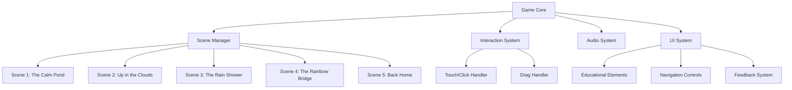
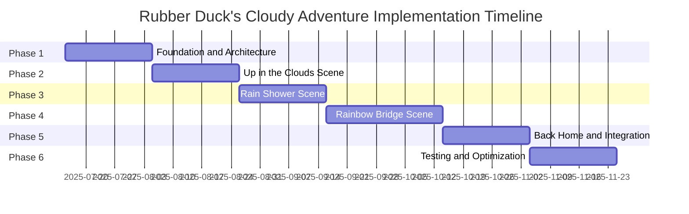

# Implementation Plan: Rubber Duck's Cloudy Adventure

This document outlines the technical implementation plan for bringing the "Rubber Duck's Cloudy Adventure" children's story (ages 3-5) to life as an interactive web-based experience.

## Table of Contents
- [Current Implementation](#current-implementation)
- [Story Overview](#story-overview)
- [High-Level Technical Plan](#high-level-technical-plan)
- [New Features and Mechanics](#new-features-and-mechanics)
- [Extending the Existing Code](#extending-the-existing-code)
- [Potential Technical Challenges](#potential-technical-challenges)
- [Phased Implementation Approach](#phased-implementation-approach)

## Current Implementation

The existing implementation includes:
- 3D scene with Three.js featuring a static rubber duck model
- Skybox with gradient, ground plane, and animated cloud system
- "START" button that triggers camera animation to move closer to the duck
- No gameplay mechanics beyond camera movement

## Story Overview

"Rubber Duck's Cloudy Adventure" follows Sunny the rubber duck through five distinct scenes:

1. **The Calm Pond** (Current Implementation)
   - Sunny floats peacefully in his pond (static duck model)
   - Clouds move slowly across the sky (existing cloud system)
   - Player clicks "START" to begin the adventure (existing camera zoom)

2. **Up in the Clouds**
   - Camera shows Sunny floating among the clouds
   - Simple interaction: Tap clouds to make them change shape
   - Educational element: Count the clouds (1-5) as they pass by

3. **The Rain Shower**
   - Darker skybox with raindrops (could be simple particle effects)
   - Interaction: Tap Sunny to make him quack happily in the rain
   - Learning: Cause/effect - rain makes puddles below

4. **The Rainbow Bridge**
   - Skybox changes to show a rainbow
   - Interaction: Drag finger to help Sunny slide down the rainbow
   - Color recognition: Name the rainbow colors as Sunny passes them

5. **Back Home**
   - Camera returns to original view (reverse of START animation)
   - Sunny is back in his pond, story comes full circle
   - Interaction: Tap Sunny to hear a happy quack

## High-Level Technical Plan

### Overall Architecture



### Core Systems

#### Scene Management System
- Create a `SceneManager` class to handle:
  - Scene initialization, transitions, and cleanup
  - Scene state management
  - Progress tracking through the story
  - Loading/unloading scene-specific assets

```javascript
class SceneManager {
  constructor() {
    this.scenes = {};
    this.currentScene = null;
    this.transitionInProgress = false;
  }

  registerScene(name, sceneClass) { /* ... */ }
  transitionTo(sceneName, transitionEffect) { /* ... */ }
  update(deltaTime) { /* ... */ }
}
```

#### Interaction System
- Implement a unified interaction system that handles:
  - Touch/click detection for objects in the scene
  - Drag/swipe gestures
  - Object highlighting on hover/touch
  - Event dispatching to scene-specific handlers

#### Audio System
- Create a simple audio manager for:
  - Sound effects (quacking, rain, etc.)
  - Background ambient sounds
  - Voice narration for educational elements
  - Preloading and caching audio assets

#### UI System
- Develop a flexible UI system for:
  - Educational overlays (numbers, colors, etc.)
  - Navigation controls (scene progression)
  - Visual feedback for interactions
  - Accessibility considerations for young children

### Scene-Specific Implementations

#### Scene 1: The Calm Pond (Current Implementation)
- Refactor existing code to fit within the new architecture
- Add simple duck interaction (tap to quack)
- Prepare for transition to next scene

#### Scene 2: Up in the Clouds
- Implement cloud interaction system:
  - Cloud shape changing on tap
  - Cloud counting mechanism
  - UI overlay for counting feedback
- Position camera and duck among clouds
- Add cloud-specific ambient sounds

#### Scene 3: The Rain Shower
- Create rain particle system:
  - Configurable intensity
  - Particle collision with ground to form puddles
- Implement darker skybox shader
- Add rain sound effects
- Implement duck quacking interaction

#### Scene 4: The Rainbow Bridge
- Create rainbow visualization:
  - Curved path for duck movement
  - Color segments with highlighting
- Implement drag interaction for duck movement
- Add color recognition UI elements
- Implement color narration

#### Scene 5: Back Home
- Implement reverse camera animation
- Restore original scene elements
- Add final duck interaction
- Create story completion feedback

### Educational Integration

#### Counting (Scene 2)
- Highlight clouds as they're counted
- Display numbers 1-5 as visual feedback
- Optional voice narration of numbers

#### Cause and Effect (Scene 3)
- Visualize rain drops creating puddles
- Show relationship between rain intensity and puddle size
- Provide visual/audio feedback

#### Color Recognition (Scene 4)
- Highlight and name rainbow colors as duck passes
- Provide visual reinforcement of color names
- Optional interactive color matching

## New Features and Mechanics

### Scene 1: The Calm Pond (Current Implementation)
- **New Features:**
  - Duck interaction: Tap detection on the duck model
  - Simple animation: Duck bobbing in water
  - Sound effect: Quacking sound when tapped
  - Visual feedback: Ripple effect in water when duck is tapped
  - Scene transition trigger: After START animation completes

### Scene 2: Up in the Clouds
- **New Features:**
  - Camera positioning system: Move camera and duck among clouds
  - Cloud interaction system:
    - Collision detection for cloud objects
    - Cloud shape morphing on tap (geometry manipulation)
    - Visual feedback for tappable clouds
  - Cloud counting mechanism:
    - Cloud highlighting system
    - Sequential counting logic (1-5)
    - Number display UI
    - Audio narration of numbers
  - Scene progression trigger

### Scene 3: The Rain Shower
- **New Features:**
  - Weather transition effect: Clear to rainy
  - Skybox modification: Darker gradient shader
  - Rain particle system:
    - Particle emitter configuration
    - Particle physics (falling raindrops)
    - Collision detection with ground
  - Puddle formation visualization:
    - Dynamic texture or mesh generation for puddles
    - Growth animation based on rainfall
  - Duck interaction:
    - Tap detection on duck model
    - Happy animation when tapped
    - Quacking sound effect
  - Educational UI for cause/effect explanation
  - Scene progression trigger

### Scene 4: The Rainbow Bridge
- **New Features:**
  - Rainbow visualization:
    - Curved path geometry
    - Multi-colored shader or segmented mesh
    - Glow effect
  - Duck movement system:
    - Path following logic
    - Position constraint to rainbow curve
  - Drag/swipe interaction:
    - Touch/mouse input tracking
    - Velocity-based movement
    - Bounds checking
  - Color highlighting system:
    - Segment detection (which color is duck currently on)
    - Visual highlighting of current color
  - Color education UI:
    - Color name display
    - Audio narration of color names
  - Scene progression trigger

### Scene 5: Back Home
- **New Features:**
  - Reverse camera animation:
    - Path following back to original position
    - Smooth transition
  - Scene restoration:
    - Reset any modified scene elements
    - Return duck to original position
  - Final interaction:
    - Tap detection on duck
    - Happy animation
    - Quacking sound
  - Story completion feedback:
    - Celebration effect (particles, sounds)
    - Replay option UI

### Common New Features Across All Scenes
- **Scene Management System:**
  - Scene state tracking
  - Transition effects between scenes
  - Asset loading/unloading
- **Interaction System:**
  - Universal touch/click detection
  - Object highlighting on hover/touch
  - Gesture recognition for drag/swipe
- **Audio System:**
  - Sound effect management
  - Background ambient sounds
  - Voice narration support
- **UI System:**
  - Educational overlay components
  - Navigation controls
  - Visual feedback elements
- **Progress Tracking:**
  - Story progression state
  - Scene completion tracking
  - Optional: save/resume functionality

## Extending the Existing Code

### Code Structure Refactoring

#### Current Structure:
- All code is in a single HTML file with inline JavaScript
- Functions are defined but not organized into classes
- Limited separation of concerns

#### Proposed Extension:
```
// Refactor into modular structure
// index.html - Main HTML structure
// src/
//   ├── core/
//   │   ├── Game.js - Main game class
//   │   ├── SceneManager.js - Scene management
//   │   ├── InteractionSystem.js - Input handling
//   │   ├── AudioManager.js - Sound management
//   │   └── UISystem.js - UI components
//   ├── scenes/
//   │   ├── BaseScene.js - Common scene functionality
//   │   ├── CalmPondScene.js - Scene 1
//   │   ├── CloudsScene.js - Scene 2
//   │   ├── RainShowerScene.js - Scene 3
//   │   ├── RainbowBridgeScene.js - Scene 4
//   │   └── BackHomeScene.js - Scene 5
//   ├── objects/
//   │   ├── Duck.js - Duck model and interactions
//   │   ├── Cloud.js - Cloud model and interactions
//   │   ├── RainSystem.js - Rain particles
//   │   └── Rainbow.js - Rainbow path
//   └── utils/
//       ├── AssetLoader.js - Asset loading utilities
//       └── MathUtils.js - Math helper functions
```

### Extending Specific Components

#### Duck Model and Interactions
```javascript
// Extend from current duck model loading
class Duck extends THREE.Group {
  constructor() {
    super();
    this.model = null;
    this.sounds = {
      quack: new Audio('sounds/quack.mp3')
    };
    this.isInteractive = true;
  }

  async load() {
    // Use existing loadDuckModel function
    this.model = await loadDuckModel();
    this.add(this.model);

    // Add interaction capabilities
    this.setupInteractions();
  }

  setupInteractions() {
    // Add to interaction system
    interactionSystem.register(this, {
      onClick: this.onTap.bind(this)
    });
  }

  onTap() {
    // Play quack sound
    this.sounds.quack.play();

    // Play animation
    this.playQuackAnimation();
  }

  playQuackAnimation() {
    // Simple animation - scale up and down
    const duration = 0.3;
    const originalScale = this.scale.clone();

    // Scale up
    gsap.to(this.scale, {
      x: originalScale.x * 1.2,
      y: originalScale.y * 1.2,
      z: originalScale.z * 1.2,
      duration: duration / 2,
      onComplete: () => {
        // Scale back
        gsap.to(this.scale, {
          x: originalScale.x,
          y: originalScale.y,
          z: originalScale.z,
          duration: duration / 2
        });
      }
    });
  }

  update(deltaTime) {
    // Add bobbing animation in water
    if (this.model) {
      this.position.y = Math.sin(Date.now() * 0.001) * 0.1;
    }
  }
}
```

#### Cloud System Enhancement
```javascript
// Extend from current createCloudSystem function
class Cloud extends THREE.Mesh {
  constructor() {
    // Create base geometry and material
    const geometry = new THREE.BoxGeometry(2, 1, 3);
    const material = new THREE.MeshStandardMaterial({
      color: 0xFFFFFF,
      roughness: 0.0,
      metalness: 0.0,
      transparent: true,
      opacity: 0.8
    });

    super(geometry, material);

    this.originalGeometry = geometry.clone();
    this.isInteractive = true;
    this.isCounted = false;
    this.cloudNumber = null;
  }

  setupInteractions() {
    interactionSystem.register(this, {
      onClick: this.onTap.bind(this)
    });
  }

  onTap() {
    // Change cloud shape
    this.morphShape();

    // If in counting mode, trigger count event
    if (this.cloudNumber !== null && !this.isCounted) {
      this.isCounted = true;
      eventBus.emit('cloudCounted', this.cloudNumber);
    }
  }

  morphShape() {
    // Create a new random shape by modifying vertices
    const newGeometry = this.originalGeometry.clone();
    const positions = newGeometry.attributes.position.array;

    for (let i = 0; i < positions.length; i += 3) {
      // Don't modify bottom vertices (keep base shape)
      if (positions[i + 1] > 0) {
        positions[i] += (Math.random() - 0.5) * 0.5;
        positions[i + 1] += (Math.random() - 0.5) * 0.5;
        positions[i + 2] += (Math.random() - 0.5) * 0.5;
      }
    }

    newGeometry.attributes.position.needsUpdate = true;
    newGeometry.computeVertexNormals();

    // Replace geometry
    this.geometry.dispose();
    this.geometry = newGeometry;
  }

  highlight() {
    // Highlight cloud when counting
    gsap.to(this.material, {
      emissive: new THREE.Color(0x3366ff),
      emissiveIntensity: 0.5,
      duration: 0.3
    });
  }

  unhighlight() {
    gsap.to(this.material, {
      emissive: new THREE.Color(0x000000),
      emissiveIntensity: 0,
      duration: 0.3
    });
  }
}
```

#### Rain Particle System (New)
```javascript
class RainSystem extends THREE.Group {
  constructor(intensity = 1.0) {
    super();
    this.intensity = intensity;
    this.maxParticles = 1000 * intensity;
    this.particles = [];
    this.puddles = [];

    this.createParticles();
    this.createPuddleSystem();
  }

  createParticles() {
    // Create particle geometry
    const geometry = new THREE.BufferGeometry();
    const positions = new Float32Array(this.maxParticles * 3);
    const velocities = new Float32Array(this.maxParticles * 3);
    const lifetimes = new Float32Array(this.maxParticles);

    // Initialize particles
    for (let i = 0; i < this.maxParticles; i++) {
      this.initParticle(i, positions, velocities, lifetimes);
    }

    geometry.setAttribute('position', new THREE.BufferAttribute(positions, 3));
    geometry.setAttribute('velocity', new THREE.BufferAttribute(velocities, 3));
    geometry.setAttribute('lifetime', new THREE.BufferAttribute(lifetimes, 1));

    // Create material
    const material = new THREE.PointsMaterial({
      color: 0x8888ff,
      size: 0.1,
      transparent: true,
      opacity: 0.6,
      blending: THREE.AdditiveBlending
    });

    // Create points system
    this.particleSystem = new THREE.Points(geometry, material);
    this.add(this.particleSystem);
  }

  update(deltaTime) {
    // Update particle positions
    const positions = this.particleSystem.geometry.attributes.position.array;
    const velocities = this.particleSystem.geometry.attributes.velocity.array;
    const lifetimes = this.particleSystem.geometry.attributes.lifetime.array;

    for (let i = 0; i < this.maxParticles; i++) {
      // Update position
      positions[i * 3] += velocities[i * 3] * deltaTime;
      positions[i * 3 + 1] += velocities[i * 3 + 1] * deltaTime;
      positions[i * 3 + 2] += velocities[i * 3 + 2] * deltaTime;

      // Update lifetime
      lifetimes[i] -= deltaTime;

      // Reset particle if it hits ground or lifetime expires
      if (positions[i * 3 + 1] < 0 || lifetimes[i] <= 0) {
        this.initParticle(i, positions, velocities, lifetimes);

        // If hitting ground, create puddle effect
        if (positions[i * 3 + 1] < 0) {
          this.createPuddleEffect(positions[i * 3], positions[i * 3 + 2]);
        }
      }
    }

    // Update buffers
    this.particleSystem.geometry.attributes.position.needsUpdate = true;
    this.particleSystem.geometry.attributes.lifetime.needsUpdate = true;

    // Update puddles
    this.updatePuddles(deltaTime);
  }
}
```

#### Rainbow Path (New)
```javascript
class Rainbow extends THREE.Group {
  constructor() {
    super();
    this.pathPoints = [];
    this.colorSegments = [
      { color: 0xFF0000, name: 'Red' },    // Red
      { color: 0xFF7F00, name: 'Orange' }, // Orange
      { color: 0xFFFF00, name: 'Yellow' }, // Yellow
      { color: 0x00FF00, name: 'Green' },  // Green
      { color: 0x0000FF, name: 'Blue' },   // Blue
      { color: 0x4B0082, name: 'Indigo' }, // Indigo
      { color: 0x9400D3, name: 'Violet' }  // Violet
    ];

    this.createRainbowPath();
  }

  createRainbowPath() {
    // Create a curved path for the rainbow
    const curve = new THREE.CubicBezierCurve3(
      new THREE.Vector3(0, 30, -50),   // Start point
      new THREE.Vector3(20, 60, -30),  // Control point 1
      new THREE.Vector3(-20, 60, 30),  // Control point 2
      new THREE.Vector3(0, 0, 50)      // End point
    );

    // Get points along the curve
    this.pathPoints = curve.getPoints(50);

    // Create a tube geometry along the curve
    const tubeGeometry = new THREE.TubeGeometry(
      curve,
      50,    // tubularSegments
      2,     // radius
      8,     // radialSegments
      false  // closed
    );

    // Create materials for each color segment
    const rainbowGroup = new THREE.Group();

    // Create a mesh for each color segment
    const segmentLength = 1 / this.colorSegments.length;

    for (let i = 0; i < this.colorSegments.length; i++) {
      const segmentGeometry = new THREE.TubeGeometry(
        curve,
        7,     // tubularSegments per color
        2,     // radius
        8,     // radialSegments
        false, // closed
        i * segmentLength,      // start
        segmentLength           // length
      );

      const material = new THREE.MeshStandardMaterial({
        color: this.colorSegments[i].color,
        emissive: this.colorSegments[i].color,
        emissiveIntensity: 0.2,
        roughness: 0.3,
        metalness: 0.7
      });

      const segment = new THREE.Mesh(segmentGeometry, material);
      segment.userData.colorName = this.colorSegments[i].name;
      segment.userData.colorIndex = i;

      rainbowGroup.add(segment);
    }

    this.add(rainbowGroup);
  }

  highlightSegment(index) {
    // Highlight a specific color segment
    this.children[0].children.forEach((segment, i) => {
      if (i === index) {
        gsap.to(segment.material, {
          emissiveIntensity: 0.8,
          duration: 0.3
        });
      } else {
        gsap.to(segment.material, {
          emissiveIntensity: 0.2,
          duration: 0.3
        });
      }
    });
  }
}
```

## Potential Technical Challenges

### Performance Considerations

#### Particle Systems
- **Challenge:** The rain particle system could be performance-intensive, especially on mobile devices or lower-end hardware.
- **Impact:** Frame rate drops could make the experience less enjoyable for young children.
- **Mitigation:**
  - Implement adaptive particle counts based on device capabilities
  - Use efficient particle update algorithms
  - Consider using sprite sheets instead of individual particles
  - Implement level-of-detail (LOD) for particles based on distance

#### Complex Geometry Manipulation
- **Challenge:** Cloud shape morphing and rainbow path creation involve complex geometry manipulation.
- **Impact:** Could cause performance issues or visual artifacts.
- **Mitigation:**
  - Pre-compute multiple cloud shapes rather than real-time morphing
  - Use shader-based effects for some visual changes instead of geometry manipulation
  - Optimize geometry by reducing vertex count where possible

#### Multiple Interactive Elements
- **Challenge:** Managing many interactive elements (clouds, duck, rainbow) simultaneously.
- **Impact:** Could lead to input lag or missed interactions.
- **Mitigation:**
  - Prioritize interactions based on current scene focus
  - Implement efficient collision detection algorithms
  - Limit the number of interactive elements active at once

### Technical Implementation Challenges

#### Scene Transitions
- **Challenge:** Smooth transitions between different scenes with varying visual elements.
- **Impact:** Jarring transitions could confuse young children.
- **Mitigation:**
  - Implement cross-fade transitions between scenes
  - Maintain consistent elements across scenes (duck, camera perspective)
  - Use narrative cues to prepare children for transitions

#### Touch/Drag Interactions
- **Challenge:** Implementing intuitive touch and drag interactions for young children.
- **Impact:** Frustration if interactions are too complex or unresponsive.
- **Mitigation:**
  - Use large hit areas for interactive elements
  - Implement forgiving input detection
  - Provide clear visual feedback for all interactions
  - Test extensively with the target age group

#### Audio Synchronization
- **Challenge:** Synchronizing audio narration with visual elements.
- **Impact:** Educational value diminished if audio and visuals are out of sync.
- **Mitigation:**
  - Implement event-based audio triggering
  - Use audio sprites for quick response times
  - Ensure audio files are pre-loaded before needed

### Educational and UX Challenges

#### Age-Appropriate Interactions
- **Challenge:** Designing interactions that are suitable for children ages 3-5.
- **Impact:** Children may struggle with complex interactions or become disengaged.
- **Mitigation:**
  - Consult early childhood education experts
  - Implement very simple, forgiving interactions
  - Provide constant positive feedback
  - Allow for repeated attempts without penalty

#### Balancing Education and Entertainment
- **Challenge:** Integrating educational elements without sacrificing fun.
- **Impact:** Children may lose interest if too educational or miss learning opportunities if too entertainment-focused.
- **Mitigation:**
  - Embed educational elements naturally within the story
  - Make learning outcomes implicit in the interactions
  - Test with target age group to find the right balance

#### Accessibility Considerations
- **Challenge:** Making the experience accessible to children with different abilities.
- **Impact:** Some children may be excluded from the experience.
- **Mitigation:**
  - Implement alternative input methods
  - Provide visual and audio feedback for all interactions
  - Consider color blindness in the rainbow scene
  - Add options for simplified visuals or slower pacing

## Phased Implementation Approach

### Phase 1: Foundation and Architecture (2-3 weeks)

#### Goals:
- Refactor existing code into a modular architecture
- Implement core systems that will support all scenes
- Enhance the current "Calm Pond" scene with basic interaction

#### Tasks:
1. **Code Restructuring:**
   - Refactor into modular file structure
   - Implement scene management system
   - Create base classes for reusable components

2. **Core Systems Implementation:**
   - Interaction system for touch/click detection
   - Basic audio system for sound effects
   - Simple UI framework for educational elements

3. **Enhance Current Scene:**
   - Add duck interaction (tap to quack)
   - Improve cloud system for better performance
   - Add simple water effect to pond

#### Deliverables:
- Refactored codebase with modular architecture
- Working "Calm Pond" scene with duck interaction
- Technical foundation for subsequent scenes

### Phase 2: "Up in the Clouds" Scene (2-3 weeks)

#### Goals:
- Implement the second scene of the story
- Create cloud interaction mechanics
- Add first educational element (counting)

#### Tasks:
1. **Scene Transition:**
   - Implement camera animation to clouds
   - Create smooth transition effect between scenes
   - Add narrative cue for scene change

2. **Cloud Interactions:**
   - Enhance cloud system with tap detection
   - Implement cloud shape morphing
   - Add visual feedback for interactive clouds

3. **Counting Mechanic:**
   - Implement cloud counting system (1-5)
   - Add number display UI
   - Create audio narration for numbers
   - Add celebration feedback for completed counting

#### Deliverables:
- Functional "Up in the Clouds" scene
- Working cloud interaction and counting mechanic
- Smooth transition from first to second scene

### Phase 3: "Rain Shower" Scene (2-3 weeks)

#### Goals:
- Implement the third scene with weather effects
- Create rain particle system and puddle formation
- Add cause/effect educational element

#### Tasks:
1. **Weather Transition:**
   - Create transition from clouds to rain
   - Implement darker skybox shader
   - Add ambient rain sound

2. **Rain System:**
   - Implement optimized rain particle system
   - Create puddle formation visualization
   - Add splash effects for raindrops

3. **Duck Interaction:**
   - Enhance duck with rain reaction animation
   - Implement happy quack in rain
   - Create cause/effect UI explanation

#### Deliverables:
- Functional "Rain Shower" scene
- Working rain particle system with puddles
- Cause/effect educational element

### Phase 4: "Rainbow Bridge" Scene (3-4 weeks)

#### Goals:
- Implement the most complex scene with rainbow path
- Create drag interaction for duck movement
- Add color recognition educational element

#### Tasks:
1. **Rainbow Creation:**
   - Implement curved rainbow path geometry
   - Create multi-colored shader or segmented mesh
   - Add glow effect for visual appeal

2. **Duck Movement:**
   - Implement path following system
   - Create drag/swipe interaction
   - Add duck animation along rainbow

3. **Color Education:**
   - Implement color segment detection
   - Create color name display/narration
   - Add visual highlighting for current color

#### Deliverables:
- Functional "Rainbow Bridge" scene
- Working drag interaction for duck movement
- Color recognition educational element

### Phase 5: "Back Home" and Integration (2-3 weeks)

#### Goals:
- Implement final scene returning to the pond
- Integrate all scenes into cohesive story flow
- Add final polish and refinements

#### Tasks:
1. **Final Scene:**
   - Implement reverse camera animation
   - Restore original scene elements
   - Add celebration effect for story completion

2. **Story Integration:**
   - Ensure smooth transitions between all scenes
   - Add narrative elements to connect scenes
   - Implement progress tracking

3. **Polish and Refinement:**
   - Optimize performance across all scenes
   - Add final audio and visual effects
   - Implement replay functionality

#### Deliverables:
- Complete "Rubber Duck's Cloudy Adventure" story
- Smooth flow between all five scenes
- Polished, performant experience

### Phase 6: Testing and Optimization (2-3 weeks)

#### Goals:
- Test with target audience (children ages 3-5)
- Optimize performance across devices
- Fix bugs and address feedback

#### Tasks:
1. **User Testing:**
   - Conduct sessions with target age group
   - Gather feedback on interactions and engagement
   - Identify usability issues

2. **Performance Optimization:**
   - Profile and optimize rendering performance
   - Reduce memory usage
   - Optimize for mobile devices

3. **Refinement:**
   - Address bugs and issues
   - Implement feedback from testing
   - Final quality assurance

#### Deliverables:
- Tested, refined application
- Performance optimized across devices
- Final production-ready version

### Implementation Timeline



### Key Milestones and Testing Points

1. **End of Phase 1:** Technical review of architecture and foundation
2. **End of Phase 2:** First user testing with target age group (focus on counting)
3. **End of Phase 3:** Second user testing (focus on cause/effect understanding)
4. **End of Phase 4:** Third user testing (focus on color recognition and motor skills)
5. **End of Phase 5:** Full story flow testing
6. **End of Phase 6:** Final acceptance testing and launch

## Conclusion

This implementation plan provides a comprehensive roadmap for bringing the "Rubber Duck's Cloudy Adventure" story to life as an interactive, educational experience for children ages 3-5. By following the phased approach, the development team can manage complexity, gather feedback early, and deliver a high-quality product that balances entertainment and educational value.

The estimated total development time is approximately 14-19 weeks, with regular testing milestones to ensure the experience meets the needs of the target audience. The modular architecture will also allow for future expansion with additional stories or educational elements.
